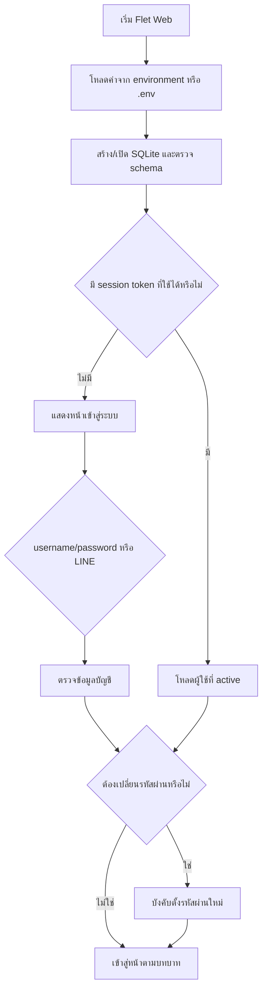
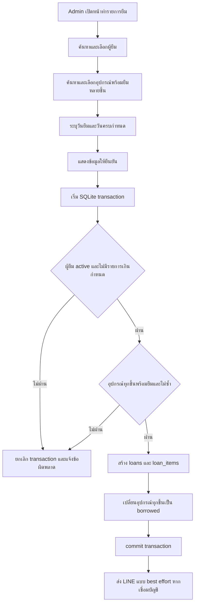
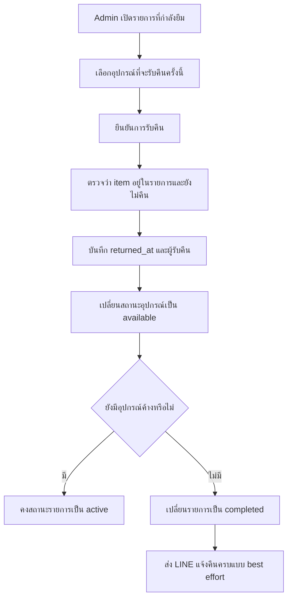
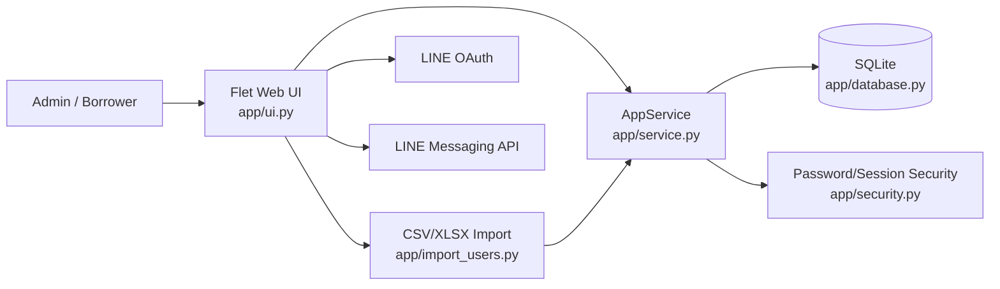
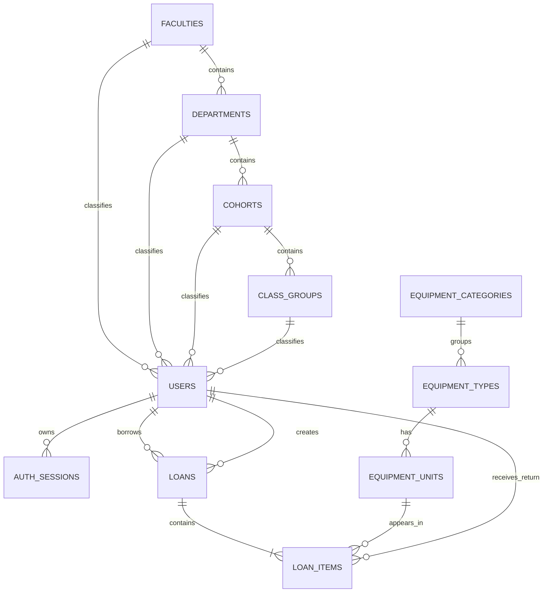

# เนื้อหาสำหรับเอกสารโครงงาน: ระบบยืม–คืนอุปกรณ์

เอกสารฉบับนี้จัดทำจาก source code, schema, tests, configuration และเอกสารขอบเขตที่อยู่ใน repository ณ วันที่ 16 กันยายน 2569 โดยยึดการทำงานที่ตรวจสอบได้จากโค้ดเป็นหลัก และใช้ `docs/project_scope.md` เพื่ออธิบายเจตนาและขอบเขตของระบบ

## 1. ภาพรวมและที่มาของโครงงาน

โครงงานนี้เป็นระบบยืม–คืนอุปกรณ์ของสาขาวิทยาการคอมพิวเตอร์ พัฒนาเป็นเว็บแอปพลิเคชันด้วยภาษา Python และ Flet ใช้ SQLite เป็นฐานข้อมูลหลัก ระบบออกแบบเป็น Minimum Viable Product (MVP) สำหรับโครงงานในรายวิชา โดยเน้นให้ขั้นตอนการทำงานสั้น ใช้งานง่าย และรองรับงานหลักตั้งแต่การจัดเตรียมข้อมูลผู้ใช้และอุปกรณ์ การบันทึกการยืม การรับคืน ไปจนถึงการตรวจสอบประวัติ

แนวคิดสำคัญของระบบคือการแยก “ข้อมูลอ้างอิง” ออกจาก “ข้อมูลธุรกรรม” อย่างชัดเจน ตัวอย่างเช่น ข้อมูลคณะ สาขา รุ่น หมู่เรียน และหมวดอุปกรณ์ถูกจัดเก็บแยกจากข้อมูลผู้ใช้ ขณะที่ชนิดอุปกรณ์ถูกแยกจากอุปกรณ์รายชิ้น และรายการยืมถูกแยกจากรายการอุปกรณ์ภายในธุรกรรม วิธีดังกล่าวช่วยให้แก้ไขหรือเพิ่มข้อมูลอ้างอิงได้โดยไม่ต้องเปลี่ยนโครงสร้างธุรกรรมหลัก

ระบบยังเชื่อมต่อกับ LINE สองส่วน ได้แก่ LINE Login สำหรับเข้าสู่ระบบ และ LINE Messaging API สำหรับแจ้งเตือนผู้ยืม ทั้งนี้ บัญชีและข้อมูลหลักของผู้ใช้ยังคงจัดเก็บอยู่ภายในระบบ โดย LINE เป็นช่องทางยืนยันตัวตนเพิ่มเติมและช่องทางรับข้อความเท่านั้น

ไม่พบข้อมูลที่ยืนยันชื่อสถาบัน ชื่อรายวิชา ผู้จัดทำ อาจารย์ที่ปรึกษา หรือกระบวนการเดิมก่อนมีระบบ จึงควรเติมข้อมูลเหล่านี้ภายหลังจากแหล่งข้อมูลของโครงงานโดยตรง

## 2. ปัญหาและเหตุผลในการพัฒนาระบบ

จากกฎธุรกิจและเกณฑ์สำเร็จที่ปรากฏในโปรเจกต์ ระบบถูกสร้างขึ้นเพื่อจัดการปัญหาเชิงระบบต่อไปนี้

1. ข้อมูลผู้ใช้ อุปกรณ์ และรายการยืม–คืนต้องสามารถจัดการผ่านหน้าจอได้ โดยผู้ดูแลไม่ต้องแก้ไขฐานข้อมูลโดยตรง
2. อุปกรณ์แต่ละชิ้นต้องมีรหัสทรัพย์สินและสถานะที่ตรวจสอบได้ เพื่อป้องกันการนำอุปกรณ์ชิ้นเดียวกันไปยืมซ้อน
3. รายการยืมหนึ่งรายการอาจมีอุปกรณ์หลายชิ้น และอาจรับคืนเพียงบางชิ้นก่อน จึงต้องติดตามสถานะในระดับอุปกรณ์รายชิ้น
4. ต้องควบคุมสิทธิ์ให้ผู้ยืมเห็นเฉพาะข้อมูลของตนเอง ขณะที่ผู้ดูแลระบบสามารถจัดการข้อมูลส่วนกลางและธุรกรรมได้
5. ผู้ใช้ที่มีรายการเกินกำหนดต้องถูกป้องกันไม่ให้ยืมเพิ่มจนกว่าจะจัดการรายการเดิม
6. การสร้างรายการยืมและเปลี่ยนสถานะอุปกรณ์ต้องเกิดขึ้นพร้อมกัน หากข้อมูลชิ้นใดไม่ถูกต้องต้องไม่เกิดรายการยืมบางส่วน
7. การเพิ่มผู้ใช้จำนวนมากด้วยการกรอกทีละคนใช้ขั้นตอนมาก ระบบจึงรองรับการนำเข้า CSV และ XLSX พร้อมตรวจข้อผิดพลาดก่อนบันทึก
8. ผู้ยืมควรได้รับข้อมูลกำหนดคืนผ่านช่องทางที่ใช้งานสะดวก จึงมีการเชื่อม LINE และการแจ้งเตือนก่อนครบกำหนด

รายการข้างต้นเป็นข้อสรุปจากความสามารถและกฎที่มีอยู่ในระบบ ไม่พบผลสำรวจ การสัมภาษณ์ผู้ใช้ สถิติความผิดพลาดของกระบวนการเดิม หรือหลักฐานว่าก่อนหน้านี้ใช้เอกสารกระดาษ จึงไม่ควรอ้างข้อมูลดังกล่าวโดยไม่มีแหล่งอ้างอิงเพิ่มเติม

## 3. วัตถุประสงค์และขอบเขตของระบบ

### 3.1 วัตถุประสงค์

1. พัฒนาเว็บแอปพลิเคชันสำหรับจัดการการยืมและคืนอุปกรณ์ของสาขาวิทยาการคอมพิวเตอร์
2. จัดเก็บข้อมูลผู้ใช้ ข้อมูลสังกัด ข้อมูลอุปกรณ์ และประวัติการยืม–คืนอย่างเป็นโครงสร้าง
3. ลดความผิดพลาดของธุรกรรมด้วยการตรวจสอบสถานะผู้ยืม สถานะอุปกรณ์ วันที่ และรายการซ้ำก่อนบันทึก
4. รองรับการยืมอุปกรณ์หลายชิ้นและการคืนบางส่วน โดยคงสถานะของอุปกรณ์แต่ละชิ้นให้ถูกต้อง
5. แบ่งสิทธิ์การใช้งานระหว่างผู้ดูแลระบบและผู้ยืม
6. รองรับการเข้าสู่ระบบและการแจ้งเตือนผ่าน LINE โดยไม่ให้ความล้มเหลวของการส่งข้อความกระทบธุรกรรมยืม–คืน
7. สนับสนุนการเพิ่มผู้ใช้จำนวนมากผ่านไฟล์ CSV หรือ XLSX พร้อมการตรวจสอบก่อนนำเข้า

### 3.2 ขอบเขตที่พัฒนา

- ระบบมีบทบาทหลัก 2 บทบาท ได้แก่ `admin` และ `borrower`
- ผู้ยืมแบ่งประเภทข้อมูลเป็นนักศึกษา อาจารย์ และเจ้าหน้าที่ แต่ใช้สิทธิ์ยืมชุดเดียวกัน
- ผู้ดูแลจัดการผู้ใช้ ข้อมูลอ้างอิง ชนิดอุปกรณ์ อุปกรณ์รายชิ้น รายการยืม การรับคืน และประวัติ
- ผู้ยืมดูภาพรวม รายการที่กำลังยืม อุปกรณ์พร้อมยืม ประวัติของตน เปลี่ยนรหัสผ่าน และจัดการการเชื่อม LINE
- ระบบรองรับการยืมหลายชิ้นในรายการเดียว การคืนบางส่วน และการปิดรายการอัตโนมัติเมื่อคืนครบ
- ระบบรองรับ LINE Login การผูก/ยกเลิกการผูกบัญชี และข้อความแจ้งยืมสำเร็จ คืนครบ และเตือนก่อนกำหนด 3 วันกับ 1 วัน
- ระบบรองรับ CSV และ XLSX สำหรับนำเข้าผู้ใช้
- ระบบใช้งานผ่านเว็บ รองรับ layout สำหรับจอกว้างและจอแคบ

### 3.3 สิ่งที่อยู่นอกขอบเขต

- การส่งคำขอยืม การจอง การต่ออายุ และกระบวนการอนุมัติหลายขั้น
- การบันทึกชำรุด สูญหาย สภาพอุปกรณ์ ค่าปรับ และการชำระเงิน
- การคำนวณวันหยุดหรือเงื่อนไขจำนวนชิ้นแยกตามประเภทผู้ยืม
- audit log, notification log และ retry queue
- อีเมลอัตโนมัติ, LINE Flex Message และแอปมือถือแยก
- multi-tenant, horizontal scaling และ distributed scheduler
- ระบบ production scale หรือฐานข้อมูลแบบกระจาย

แม้ repository ปัจจุบันมี `Dockerfile` สำหรับสร้าง container แต่เอกสารขอบเขตยังระบุว่า production deployment ไม่ใช่ส่วนหนึ่งของ MVP จึงควรอธิบาย Docker ว่าเป็นกลไกช่วยรันและ deploy ตัวแอป ไม่ใช่หลักฐานว่าระบบได้รับการออกแบบเพื่อรองรับ production scale

## 4. กลุ่มผู้ใช้งานและบทบาท

### 4.1 ผู้ดูแลระบบ (Admin)

ผู้ดูแลระบบเป็นผู้ดำเนินงานส่วนกลาง มีสิทธิ์ดังนี้

- ดู dashboard ภาพรวมจำนวนรายการกำลังยืม รายการเกินกำหนด รายการครบกำหนดวันนี้ จำนวนอุปกรณ์ที่คืนวันนี้ และจำนวนอุปกรณ์พร้อมยืม
- สร้าง แก้ไข เปิด/ปิดใช้งาน และรีเซ็ตรหัสผ่านผู้ใช้
- นำเข้าผู้ใช้จาก CSV หรือ XLSX และดูผลตรวจสอบก่อนนำเข้า
- จัดการคณะ สาขา/ภาควิชา รุ่นนักศึกษา หมู่เรียน และหมวดอุปกรณ์
- จัดการชนิดอุปกรณ์และอุปกรณ์รายชิ้น
- สร้างรายการยืมให้ผู้ยืม โดยเลือกอุปกรณ์ได้หลายชิ้น
- รับคืนอุปกรณ์ทั้งหมดหรือบางส่วน
- ดูประวัติรวมและประวัติรายบุคคล
- จัดการบัญชีและการเชื่อม LINE ของตนเอง

ระบบป้องกันไม่ให้ผู้ดูแลปิดบัญชีตนเอง และป้องกันไม่ให้ปิดผู้ดูแลคนสุดท้ายที่ยังใช้งานอยู่

### 4.2 ผู้ยืม (Borrower)

ผู้ยืมครอบคลุมข้อมูลผู้ใช้ 3 ประเภท ได้แก่ นักศึกษา อาจารย์ และเจ้าหน้าที่ โดยมีสิทธิ์ดังนี้

- ดู dashboard ของตนเอง
- ดูรายการที่ตนกำลังยืมและวันครบกำหนด
- ค้นหาและดูอุปกรณ์ที่พร้อมยืม
- ดูประวัติการยืม–คืนของตนเองเท่านั้น
- เปลี่ยนรหัสผ่าน
- เชื่อมและยกเลิกการเชื่อม LINE

ผู้ยืมไม่สามารถสร้างรายการยืม อนุมัติ แก้ไข ยกเลิก หรือจองอุปกรณ์ด้วยตนเอง การบันทึกรายการยืมและรับคืนเป็นหน้าที่ของผู้ดูแลระบบ

## 5. ฟีเจอร์และความสามารถหลัก

### 5.1 การยืนยันตัวตนและบัญชี

- เข้าสู่ระบบด้วย username/password โดยไม่สนตัวพิมพ์ใหญ่–เล็กของ username
- เก็บรหัสผ่านด้วย PBKDF2-SHA256 พร้อม salt และตรวจสอบแบบ constant-time
- บังคับเปลี่ยนรหัสผ่านเมื่อเข้าสู่ระบบครั้งแรกหรือหลังถูกรีเซ็ตรหัสผ่าน
- ฐานข้อมูลใหม่สร้างบัญชีเริ่มต้น `admin` และบังคับเปลี่ยนรหัสผ่าน
- session แบบถาวรมีอายุ 30 วัน โดยเก็บ token ฝั่งผู้ใช้และเก็บเฉพาะ hash ของ token ในฐานข้อมูล
- การเปลี่ยนหรือรีเซ็ตรหัสผ่านจะยกเลิก session เดิมของผู้ใช้
- เข้าสู่ระบบด้วย LINE หลังผูก LINE User ID กับบัญชีระบบแบบหนึ่งต่อหนึ่ง

### 5.2 การจัดการผู้ใช้

- สร้างและแก้ไขชื่อผู้ใช้ ชื่อ–นามสกุล อีเมลสำรอง บทบาท ประเภทผู้ใช้ และสังกัด
- ตรวจรูปแบบ username ให้มีความยาว 3–50 ตัวอักษร และใช้เฉพาะอักษรอังกฤษ ตัวเลข จุด ขีดล่าง และขีดกลาง
- กำหนดโครงสร้างสังกัดตามประเภทผู้ใช้ นักศึกษาต้องมีคณะ สาขา และรุ่น ส่วนหมู่เรียนจำเป็นเมื่อรุ่นมีหลายหมู่
- เปิดหรือปิดใช้งานผู้ใช้แทนการลบข้อมูลที่มีประวัติ
- รีเซ็ตรหัสผ่านกลับเป็น username และบังคับเปลี่ยนในการเข้าสู่ระบบครั้งถัดไป
- ค้นหาผู้ใช้ด้วยชื่อหรือ username

### 5.3 การนำเข้าผู้ใช้

- ดาวน์โหลด template สำหรับ CSV และ XLSX
- อ่านไฟล์และตรวจคอลัมน์ข้อมูลผู้ใช้
- ตรวจ username ซ้ำทั้งกับฐานข้อมูลและภายในไฟล์
- ตรวจบทบาท ประเภทผู้ใช้ ชื่อ และความสัมพันธ์ของคณะ สาขา รุ่น และหมู่เรียน
- แสดง preview แยกแถวที่พร้อมนำเข้าและแถวที่ผิดพลาดก่อนยืนยัน
- นำเข้าเฉพาะแถวที่ผ่านการตรวจสอบ

### 5.4 การจัดการข้อมูลอ้างอิง

- จัดการคณะ สาขา/ภาควิชา รุ่นนักศึกษา หมู่เรียน และหมวดอุปกรณ์
- ข้อมูลสาขา รุ่น และหมู่เรียนมีความสัมพันธ์แบบลำดับชั้น
- ตรวจว่าข้อมูลแม่มีอยู่และเปิดใช้งานก่อนสร้างข้อมูลลูก
- เปิดหรือปิดใช้งานข้อมูลอ้างอิงแทนการลบ

### 5.5 การจัดการอุปกรณ์

- แยกชนิดอุปกรณ์ออกจากอุปกรณ์รายชิ้น
- ชนิดอุปกรณ์เก็บชื่อ หมวดหมู่ ยี่ห้อ รุ่น รายละเอียด และสถานะ
- อุปกรณ์รายชิ้นเก็บ asset code ที่ไม่ซ้ำ ตำแหน่งจัดเก็บ และสถานะ
- สถานะอุปกรณ์รายชิ้น ได้แก่ พร้อมยืม ถูกยืม และปิดใช้งาน
- ป้องกันการปิดชนิดอุปกรณ์เมื่อยังมีอุปกรณ์ในชนิดนั้นกำลังถูกยืม
- ป้องกันการเปลี่ยนสถานะของอุปกรณ์ที่กำลังถูกยืมด้วยคำสั่งจัดการทั่วไป
- ค้นหาด้วย asset code ชื่ออุปกรณ์ หรือตำแหน่งจัดเก็บ

### 5.6 การยืมและคืน

- ผู้ดูแลค้นหาและเลือกผู้ยืมจาก dropdown ที่รองรับการค้นหา
- ค้นหาและเลือกอุปกรณ์พร้อมยืมได้หลายชิ้นในรายการเดียว
- ระบุวันยืมและวันครบกำหนด พร้อมปุ่มกำหนดระยะ 3, 7 หรือ 14 วัน
- ตรวจวันครบกำหนด รายการอุปกรณ์ซ้ำ สถานะผู้ยืม สถานะอุปกรณ์ และรายการเกินกำหนดก่อนบันทึก
- สร้างเลขรายการในรูปแบบ `LN-YYYYMMDD-NNN`
- บันทึกรายการยืม รายการอุปกรณ์ และสถานะ `borrowed` ภายใน transaction เดียว
- รับคืนได้บางส่วน โดยบันทึกวันคืนและผู้รับคืนของอุปกรณ์แต่ละชิ้น
- เปลี่ยนสถานะอุปกรณ์ที่คืนเป็น `available`
- ปิดรายการยืมเป็น `completed` โดยอัตโนมัติเมื่อไม่มีอุปกรณ์ค้างคืน

### 5.7 Dashboard การค้นหา และประวัติ

- Dashboard แสดงตัวชี้วัดตามบทบาท
- ผู้ดูแลค้นหารายการด้วยเลขรายการ ชื่อ หรือ username
- ผู้ยืมเห็นเฉพาะรายการกำลังยืมและประวัติของตน
- ตารางรองรับการเลื่อนแนวนอนเมื่อพื้นที่หน้าจอไม่เพียงพอ
- สถานะแสดงทั้งข้อความและสีเพื่อช่วยให้แยกแยะได้ชัดเจน

### 5.8 LINE

- LINE Login ใช้ OAuth ผ่าน Flet
- ผู้ใช้ LINE ครั้งแรกต้องยืนยัน username/password ของระบบก่อนผูกบัญชี
- LINE หนึ่งบัญชีผูกกับบัญชีระบบได้หนึ่งบัญชี
- ส่งข้อความเมื่อยืมสำเร็จ คืนครบรายการ และก่อนครบกำหนด 3 วันกับ 1 วัน
- reminder ทำงานเมื่อ process เริ่มต้นและตรวจซ้ำทุก 24 ชั่วโมง
- เก็บเวลาที่ claim reminder ลงในรายการยืมเพื่อป้องกันการส่งซ้ำ
- การส่งข้อความเป็นแบบ best effort หากส่งไม่สำเร็จจะไม่ rollback ธุรกรรมยืมหรือคืน

## 6. ขั้นตอนและ Flow การทำงานของระบบ

### 6.1 Flow การเริ่มระบบและเข้าสู่ระบบ

ระบบจะสร้าง schema อัตโนมัติเมื่อเปิดฐานข้อมูล และเพิ่มบัญชีผู้ดูแลเริ่มต้นเมื่อยังไม่มีบัญชีดังกล่าว หลังเข้าสู่ระบบสำเร็จ ระบบสร้าง persistent session token อายุ 30 วัน หน้าเว็บจึงสามารถกู้สถานะการเข้าสู่ระบบหลัง refresh ได้ ตราบใดที่ token ยังไม่หมดอายุ ผู้ใช้ยัง active และฐานข้อมูล session เดิมยังคงอยู่

### 6.2 Flow การสร้างรายการยืม

### 6.3 Flow การรับคืน

### 6.4 Flow การนำเข้าผู้ใช้

1. ผู้ดูแลดาวน์โหลด template CSV หรือ XLSX
2. กรอกข้อมูลตามคอลัมน์ที่กำหนดและเลือกไฟล์กลับเข้าสู่ระบบ
3. ระบบอ่านข้อมูล ตรวจรูปแบบ username ข้อมูลซ้ำ บทบาท ประเภทผู้ใช้ และความสัมพันธ์ของสังกัด
4. ระบบแสดงจำนวนแถวที่พร้อมนำเข้าและแถวที่ผิดพลาด พร้อมข้อความระดับแถว
5. เมื่อยืนยัน ระบบสร้างเฉพาะผู้ใช้จากแถวที่ผ่านการตรวจสอบ

### 6.5 Flow การแจ้งเตือนกำหนดคืน

1. เมื่อโปรแกรมเริ่มทำงาน ระบบตรวจรายการที่ครบกำหนดในอีก 3 วันหรือ 1 วัน
2. เลือกเฉพาะรายการ active ที่ผู้ยืมผูก LINE แล้วและยังไม่เคย claim การแจ้งเตือนช่วงนั้น
3. บันทึกเวลา claim ลง `reminder_3d_at` หรือ `reminder_1d_at`
4. ส่งข้อความผ่าน LINE Messaging API
5. ทำซ้ำทุก 24 ชั่วโมงขณะที่ process ยังทำงาน

ข้อจำกัดของ flow นี้คือไม่มี retry queue หากส่งไม่สำเร็จ และไม่มีการส่งย้อนหลังสำหรับช่วงเวลาที่ process หยุดทำงาน

## 7. เทคโนโลยีและสถาปัตยกรรมที่ใช้

### 7.1 เทคโนโลยี

| เทคโนโลยี | การใช้งานที่ตรวจพบ |
| --- | --- |
| Python 3 | ภาษาหลักของระบบ; Docker ใช้ Python 3.12 |
| Flet 0.86.1 | สร้าง UI และรันเป็นเว็บแอปพลิเคชัน |
| SQLite | จัดเก็บข้อมูลหลัก ธุรกรรม และ session |
| openpyxl 3.1.5 | อ่านและสร้างไฟล์ XLSX สำหรับ import ผู้ใช้ |
| Python `csv` | อ่านและสร้างไฟล์ CSV |
| PBKDF2-SHA256 | hash รหัสผ่านผู้ใช้ |
| LINE OAuth | LINE Login |
| LINE Messaging API | push ข้อความแจ้งเตือนแบบข้อความธรรมดา |
| pytest 8.4.1 | automated tests ที่ระดับ service/import |
| Docker | สร้าง runtime image และเปิดบริการด้วยพอร์ตจาก environment |

ไม่พบ lint configuration และไม่พบ static type-check configuration ใน repository

### 7.2 สถาปัตยกรรม

ระบบเป็น modular monolith ภายใน process เดียว ไม่มี API server แยกและไม่มี repository abstraction โดยแบ่งความรับผิดชอบดังนี้

- `main.py` โหลด environment และเริ่ม `AppUI`
- `app/ui.py` ดูแลหน้าเว็บ navigation dialog การโต้ตอบ และเรียก service
- `app/service.py` เป็น boundary หลักของกฎธุรกิจ สิทธิ์ และคำสั่ง SQLite
- `app/database.py` กำหนด schema การเชื่อมต่อ เวลา และตำแหน่งฐานข้อมูล
- `app/import_users.py` อ่าน template ตรวจข้อมูล และนำเข้าผู้ใช้
- `app/line.py` กำหนด OAuth provider และส่งข้อความ LINE
- `app/security.py` จัดการ password hash และ session token
- `app/models.py` เก็บ data model ที่ใช้ระหว่างโมดูล

สถาปัตยกรรมนี้เหมาะกับ MVP ที่มีขอบเขตจำกัด เพราะมีเส้นทางข้อมูลสั้นและกฎธุรกิจรวมอยู่ที่ service เดียว แต่ไม่ได้ออกแบบสำหรับการขยายหลาย instance หรือระบบแบบกระจาย

## 8. โครงสร้างและการออกแบบฐานข้อมูลในภาพรวม

ฐานข้อมูลมี 11 ตาราง แบ่งเป็น 5 กลุ่ม

1. ข้อมูลสังกัด: `faculties`, `departments`, `cohorts`, `class_groups`
2. ผู้ใช้และ session: `users`, `auth_sessions`
3. ข้อมูลอุปกรณ์: `equipment_categories`, `equipment_types`, `equipment_units`
4. ธุรกรรมยืม: `loans`
5. รายการอุปกรณ์ในธุรกรรม: `loan_items`

### 8.1 หลักการออกแบบที่สำคัญ

- username และ asset code ใช้ `COLLATE NOCASE` และ unique constraint เพื่อป้องกันข้อมูลซ้ำโดยไม่สนตัวพิมพ์
- LINE User ID เป็นค่า unique เพื่อบังคับความสัมพันธ์หนึ่งบัญชี LINE ต่อหนึ่งบัญชีระบบ
- ข้อมูลอ้างอิงและข้อมูลหลักมีสถานะ active/inactive เพื่อรักษาประวัติแทนการลบ
- `equipment_units.status` จำกัดเป็น available, borrowed หรือ inactive
- `loans.status` จำกัดเป็น active หรือ completed
- `loan_items.returned_at` ทำให้ติดตามการคืนรายชิ้นและรองรับ partial return
- foreign key ถูกเปิดใช้งานทุก connection
- ใช้ `BEGIN IMMEDIATE` สำหรับคำสั่งสำคัญที่ต้องตรวจและเขียนข้อมูลร่วมกัน
- วันที่ทางธุรกิจใช้เขตเวลา Asia/Bangkok ส่วน timestamp จัดเก็บเป็น UTC รูปแบบ `Z`
- มี index สำหรับสถานะผู้ใช้ session หมดอายุ สถานะอุปกรณ์ รายการยืมของผู้ใช้ และรายการย่อยของการยืม

### 8.2 ตำแหน่งฐานข้อมูล

ค่าเริ่มต้นคือ `data/equipment_lending.db` และเปลี่ยนได้ด้วย environment variable `APP_DB_PATH` หากรันบน container หรือ hosting ที่ filesystem ไม่ถาวร ต้องกำหนด persistent storage หรือเปลี่ยนแนวทางฐานข้อมูล มิฉะนั้นข้อมูล SQLite อาจสูญหายเมื่อ instance ถูกสร้างใหม่ ทั้งนี้ repository ยังไม่มี PostgreSQL adapter หรือ migration สำหรับฐานข้อมูลชนิดอื่น

## 9. จุดเด่นและประโยชน์ของระบบ

### 9.1 จุดเด่นที่ยืนยันได้จากการออกแบบ

- ขั้นตอนยืมรวมการเลือกผู้ยืม อุปกรณ์หลายชิ้น วันที่ และการยืนยันไว้ใน flow เดียว
- transaction ป้องกันการสร้างรายการยืมเพียงบางส่วนและช่วยรักษาความสอดคล้องของสถานะอุปกรณ์
- แยกชนิดอุปกรณ์กับทรัพย์สินรายชิ้น ทำให้ติดตาม asset code และสถานะจริงของแต่ละชิ้นได้
- รองรับ partial return โดยไม่จำเป็นต้องปิดรายการทั้งชุดก่อน
- มี validation ครอบคลุมความสัมพันธ์ของข้อมูลผู้ใช้ สถานะบัญชี สถานะอุปกรณ์ วันที่ และรายการซ้ำ
- ใช้การปิดใช้งานเพื่อรักษาข้อมูลที่มีประวัติ
- import มี preview และ error รายแถว ช่วยลดการสร้างข้อมูลผิดจากไฟล์
- การแบ่งสิทธิ์ทำให้ผู้ยืมเห็นเฉพาะข้อมูลของตน ขณะที่งานเปลี่ยนแปลงข้อมูลสำคัญอยู่กับผู้ดูแล
- LINE เป็นส่วนเสริมแบบ best effort ความขัดข้องภายนอกจึงไม่ทำให้ธุรกรรมหลักย้อนกลับ
- UI ใช้แนวทาง search-first มี confirmation ก่อน mutation สำคัญ และใช้ข้อความร่วมกับสีสำหรับสถานะ

### 9.2 ประโยชน์ที่ระบบถูกออกแบบให้รองรับ

- ทำให้ข้อมูลผู้ใช้ อุปกรณ์ และรายการยืม–คืนอยู่ในโครงสร้างเดียวกัน
- ช่วยให้ตรวจสอบผู้ครอบครองอุปกรณ์ สถานะ และกำหนดคืนได้จากระบบ
- ลดโอกาสยืมอุปกรณ์ซ้อนหรือบันทึกธุรกรรมไม่ครบชุดด้วย validation และ transaction
- ช่วยติดตามการคืนทีละชิ้นในรายการที่มีอุปกรณ์หลายชิ้น
- ช่วยให้ผู้ยืมตรวจสอบรายการและประวัติของตนเองได้
- เพิ่มช่องทางแจ้งเตือนผ่าน LINE สำหรับผู้ใช้ที่เชื่อมบัญชี

คำว่า “ลดเวลา” หรือ “เพิ่มประสิทธิภาพ” ยังไม่มีผลการวัดก่อนและหลัง จึงควรนำเสนอเป็นประโยชน์ที่คาดหมายจากการออกแบบ ไม่ใช่ผลเชิงสถิติ

## 10. ผลลัพธ์ที่ได้จากการพัฒนา

ผลลัพธ์ที่ตรวจสอบได้จาก repository มีดังนี้

1. ได้เว็บแอปพลิเคชัน Flet ที่มีหน้าจอแยกตามบทบาท admin และ borrower
2. ได้ schema SQLite ครอบคลุมข้อมูลอ้างอิง ผู้ใช้ session อุปกรณ์ และธุรกรรมยืม–คืน รวม 11 ตาราง
3. ได้ service layer ที่บังคับสิทธิ์และกฎธุรกิจของการสร้างผู้ใช้ อุปกรณ์ การยืม การคืน และ reminder
4. ได้ระบบเข้าสู่ระบบด้วย username/password, persistent session และ LINE Login
5. ได้ระบบ import ผู้ใช้จาก CSV/XLSX พร้อม template, preview และ validation รายแถว
6. ได้การแจ้งเตือน LINE สำหรับยืมสำเร็จ คืนครบ และก่อนครบกำหนด
7. ได้ Dockerfile สำหรับสร้างและรันระบบเป็น container โดยรับค่าพอร์ตจาก environment
8. automated tests ปัจจุบันมี 15 กรณีและผ่านทั้งหมดในการตรวจครั้งนี้ ครอบคลุมบัญชีเริ่มต้น session username validation โครงสร้างสังกัด atomic loan partial return overdue guard LINE linking reminder schema ขอบเขต สถานะอุปกรณ์ เขตเวลา ข้อมูลแม่ และ import
9. คำสั่ง `python -m compileall -q main.py app` ผ่านในการตรวจครั้งนี้

ผลลัพธ์ที่ยังยืนยันไม่ได้จาก repository ได้แก่ ผลการใช้งานกับผู้ใช้จริง ระยะเวลาที่ลดลง ความพึงพอใจ จำนวนผู้ใช้พร้อมกัน performance benchmark uptime ความถูกต้องของ LINE callback/push กับ channel จริง และความพร้อมใช้งานระยะยาวบน production hosting

## 11. สรุปสำหรับเอกสารฉบับเต็ม

โครงงานระบบยืม–คืนอุปกรณ์เป็นเว็บแอปพลิเคชันสำหรับสนับสนุนงานของสาขาวิทยาการคอมพิวเตอร์ โดยรวมการจัดการข้อมูลผู้ใช้ ข้อมูลอ้างอิง อุปกรณ์รายชิ้น การยืมหลายชิ้น การคืนบางส่วน ประวัติ และการแจ้งเตือน LINE ไว้ในระบบเดียว ระบบแบ่งบทบาทเป็นผู้ดูแลและผู้ยืมอย่างชัดเจน ผู้ดูแลเป็นผู้บันทึกธุรกรรม ส่วนผู้ยืมสามารถตรวจสอบข้อมูลของตนเองและอุปกรณ์พร้อมยืมได้

หัวใจด้านความถูกต้องอยู่ที่ service layer และ transaction ของ SQLite การสร้างรายการยืมจะเกิดขึ้นก็ต่อเมื่อผู้ยืมและอุปกรณ์ทุกชิ้นผ่านเงื่อนไข และการเปลี่ยนสถานะอุปกรณ์จะถูกบันทึกพร้อมกับรายการยืมใน transaction เดียว การคืนติดตามในระดับอุปกรณ์รายชิ้น จึงรองรับการคืนไม่พร้อมกันและปิดรายการอัตโนมัติเมื่อครบทุกชิ้น

ด้านการใช้งาน ระบบใช้รูปแบบ search-first มีตารางสรุป status ที่มีทั้งข้อความและสี dialog ยืนยันก่อนเปลี่ยนข้อมูลสำคัญ และ layout ที่ปรับตามขนาดหน้าจอ การนำเข้า CSV/XLSX ช่วยเพิ่มผู้ใช้หลายรายพร้อมตรวจสอบข้อมูลก่อนบันทึก ขณะที่ LINE ช่วยให้ผู้ใช้เข้าสู่ระบบและรับการแจ้งเตือนได้โดยไม่ผูกความสำเร็จของธุรกรรมกับบริการภายนอก

ระบบเหมาะกับการเป็น MVP สำหรับโครงงานในรายวิชาตามขอบเขตที่กำหนด อย่างไรก็ตาม ยังไม่มีหลักฐานการประเมินกับผู้ใช้จริงหรือการทดสอบ production scale และ SQLite ต้องอาศัย persistent filesystem เมื่อนำไปรันบน hosting แบบ container การพัฒนาต่อควรเริ่มจากการทดสอบ LINE กับ channel จริง การทดสอบ UI แบบอัตโนมัติ การประเมินผู้ใช้ และการวางแผนจัดเก็บข้อมูลถาวรตามสภาพแวดล้อม deploy

## แหล่งหลักฐานภายในโปรเจกต์

| ประเด็น | แหล่งที่ตรวจสอบ |
| --- | --- |
| เป้าหมาย ขอบเขต บทบาท และสิ่งที่ไม่ทำ | `docs/project_scope.md` |
| แผนสถาปัตยกรรมและ flow | `docs/system-plan.md` |
| สถานะการดำเนินงานและข้อจำกัด LINE | `docs/implementation-plan.md` |
| schema และการจัดการเวลา/ไฟล์ฐานข้อมูล | `app/database.py` |
| กฎธุรกิจ สิทธิ์ transaction และ query | `app/service.py` |
| หน้าจอ navigation และ user flow | `app/ui.py` |
| LINE Login และ push message | `app/line.py` |
| password และ session token | `app/security.py` |
| CSV/XLSX import | `app/import_users.py` |
| พฤติกรรมที่มี automated test | `tests/test_scope_core.py`, `tests/test_scope_import.py` |
| dependency และ runtime | `requirements.txt`, `requirements-dev.txt`, `Dockerfile` |

## ข้อมูลที่ต้องเติมก่อนจัดทำเล่มฉบับสมบูรณ์

- ชื่อสถาบัน คณะ รายวิชา ปีการศึกษา และอาจารย์ที่ปรึกษา
- ชื่อและรหัสนักศึกษาของผู้จัดทำ
- หลักฐานกระบวนการเดิม เช่น แบบสัมภาษณ์ ปัญหาที่พบจริง หรือ workflow ก่อนพัฒนา
- requirement จากผู้มีส่วนได้ส่วนเสียและวิธีเก็บ requirement
- ภาพหน้าจอระบบฉบับที่ใช้ส่งโครงงาน
- วิธีทดลอง เกณฑ์ประเมิน กลุ่มตัวอย่าง และผลประเมินผู้ใช้
- ผลทดสอบ LINE กับ channel จริง
- URL และรายละเอียดสภาพแวดล้อม deploy หากต้องการกล่าวว่าเปิดใช้งานออนไลน์แล้ว
- ข้อมูลเชิงปริมาณ เช่น เวลาเฉลี่ยก่อน–หลัง อัตราความผิดพลาด และความพึงพอใจ

